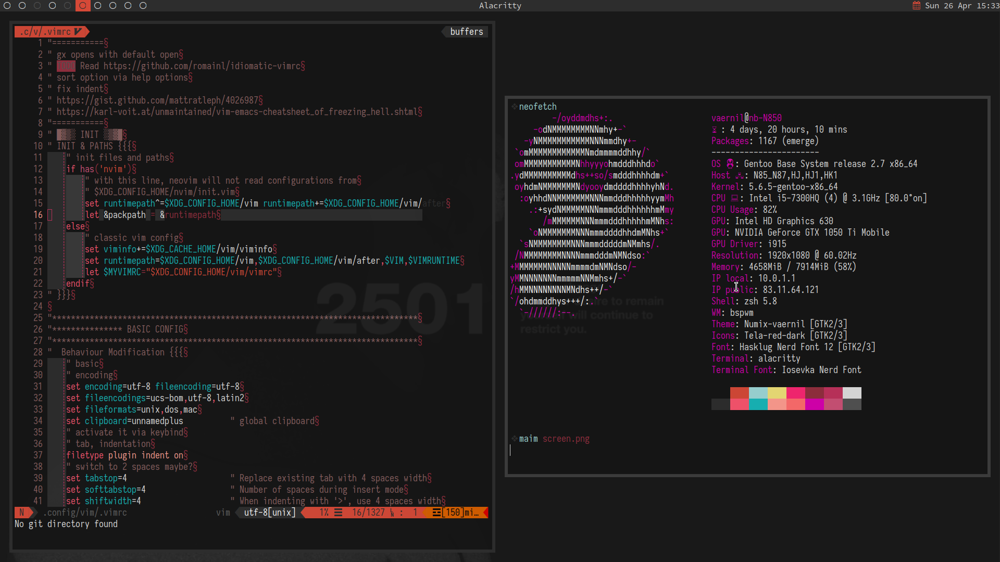

# Vaernil's dotfiles of super fun and adventure

It's just a bunch of dotfiles for my linux machines. It's very WIP and I'm starting to realize it's going to be WIP until the end of times, just like my car project</br>
I'm still learning gentoo, basic scripting and git usage. This is basically my sandbox, so don't look at me and my files judgingly :)

For now I decided to split it into branches, depending on the computer I'm using. Might reconsider it, as I learn more about git.
I have no idea what master branch is supposed to be. Neutral configs I port anywhere I want? And then add the extras if needed? Dunno yet.<br>
I'm starting to lean towards using just one - master - branch.

To rethink

## Inspiration
* [r/unixporn](https://www.reddit.com/r/unixporn/)
* [@z3bra](http://blog.z3bra.org/)
* [@neeasade](https://github.com/neeasade/dotfiles)
* [@noctuid](https://github.com/noctuid/dotfiles)
* [@windelicato](https://github.com/windelicato/dotfiles)
* [@SeraphyBR](https://github.com/SeraphyBR/DotFiles)
* [@durdn](https://developer.atlassian.com/blog/2016/02/best-way-to-store-dotfiles-git-bare-repo/)
	
## PC
### Screenshot

## Laptop
### Screenshot
2020-04-26</br>
</br>

## Install on new machines - not tested
## Requirements

* Git
	* [Gentoo](https://wiki.gentoo.org/wiki/Git)
		``` bash
		sudo emerge -av dev-vcs/git
		git config --global user.name  "Vaernil"
		git config --global user.email "vaernil@gmail.com"
		```
	* [Arch](https://wiki.archlinux.org/index.php/git)
		``` bash
		sudo pacman -S git
		git config --global user.name  "Vaernil"
		git config --global user.email "vaernil@gmail.com"
		```

* Curl
	* [Gentoo](https://packages.gentoo.org/packages/net-misc/curl)
		``` bash
		sudo emerge -av net-misc/curl
		```
	* [Arch](https://wiki.archlinux.org/index.php/Autofs)
		``` bash
		sudo pacman -S autofs
		```
## Install

Install .dotfiles tracking in your $HOME by running:
``` bash
curl -Lks bit.do/cfg_install | /bin/bash
```
This is a short url that leads to:
[dotfiles/.scripts/idot_new_cfg](https://raw.githubusercontent.com/Vaernil/dotfiles/master/.scripts/idot_new_cfg)
doesn't work atm

## Reading material for myself
* [General]
* [Linux]
	* [SSH](https://wiki.archlinux.org/index.php/Secure_Shell)
	* [SSH-keys](https://wiki.archlinux.org/index.php/SSH_keys)
* [Gentoo]
* [Arch]
## TODO
* tweak vim colors and change few highlight groups
* change vim airline prompt and also change colors
* try changing gtk colors so I can distinguish active chrome tabs from inactive ones, right now it's way to dark, or find a way to add an accent somehow
* write notification and popup scripts, dimensions should be based on text and geometry from where they were called from, basically I want them to show up bellow and perfectly centered, I could hardcode it, but where is the fun in that
* make dropdown menu for apps, networks, powerdown actions
* move your modified vim themes to separate files
* add custom software/dependencies?
* fn keys
* backlight
* refactor
* should I even consider uploading global config files like world or make.conf? and then how,
  symlinks? what about /etc?
* convert your modified themes to normal repos so you can load them with vimplug
* consider removing vim plugins and just do PlugInstall
* check if your scripts are POSIX, either port them or stick to #!/usr/bin/env
* port the settings to your pihole
and much more
